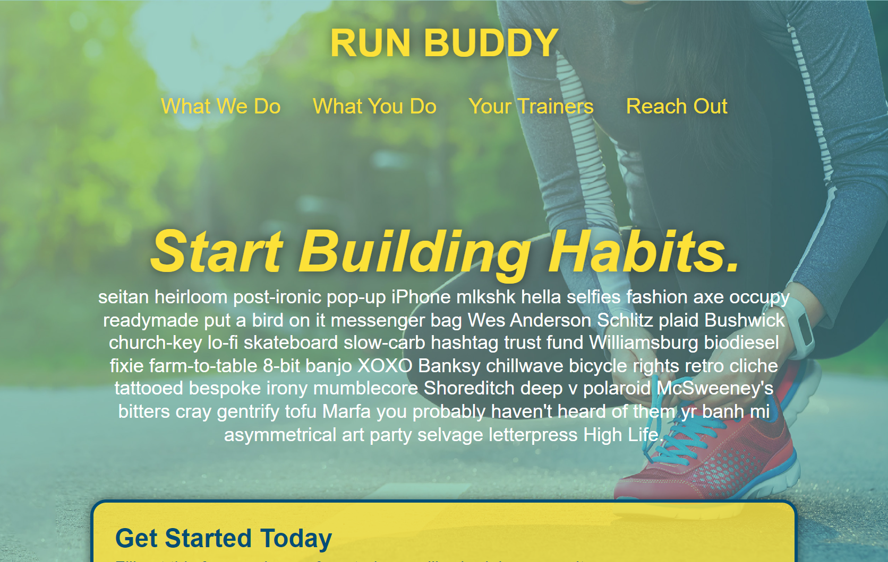

# Run Buddy

 
  ## Description
  Our first project in our Full Stack course. This was solely a foray into the front-end, including forms, CSS, and multiple HTML pages. Though I didn't know it at the time, it was also our first experience in responsiveness and mobile-first design.
  
  ## Table of Contents
  
  * [Installation/Usage](#installation/usage)
  * [Credits](#credits)
  * [License](#license)
  * [Contributions](#contributions)
  * [Tests](#tests)
  * [Questions](#questions)
  
  # Installation/Usage
  There's no installation required here. The back-end was nonexistant by design, so there's no hookup to the forms that were made. However, you can view the deployed app [here](https://xiov91.github.io/run-buddy/)
  
  ## Credits
  N/A
  
  ## License
  N/A
  
  ## Contributions
  N/A
  
  ## Tests
  No tests were set up for this project.

  ## Questions
  * GitHub: xiov91
  * E-Mail: xiovacc@gmail.com
